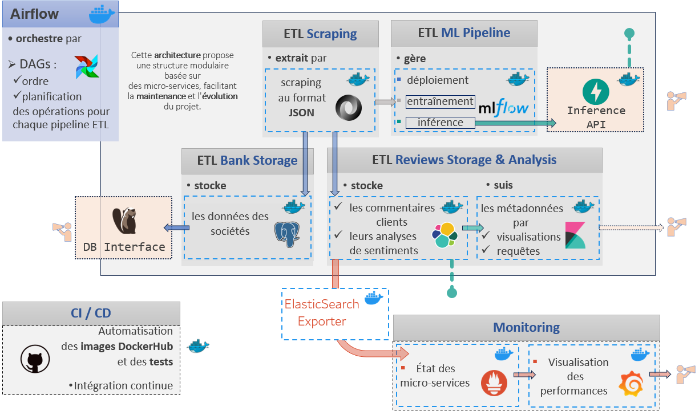
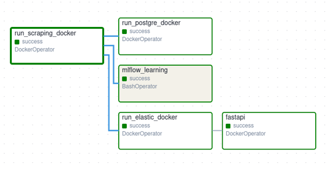

# Satisfaction Clients

Ce projet vise à analyser les avis des clients sur des organismes bancaires et à fournir une visualisation des métadonnées et des analyses de sentiments à travers plusieurs outils technologiques. Le projet utilise des technologies comme Airflow, ElasticSearch, PostgreSQL, MLflow, FastAPI, et Docker.

## Table des matières

- [Installation](#installation)
- [Structure et architecture du projet](#structure-du-projet)
- [Utilisation](#utilisation)
- [Auteurs](#auteurs)

## Installation

Pour installer et lancer le projet, suivez les étapes ci-dessous :

1. Clonez ce dépôt GitHub :

    ```bash
    git clone https://github.com/johann-DP/satisfaction-client.git
   ```
   ```bash
    cd projet_DST_satisfaction_client
    ```

2. Naviguez dans le répertoire du projet et suivez les instructions pour chaque composant.

### Prérequis

- Environnement Linux
- Docker
- Docker Compose

## Structure et architecture du projet

Le répertoire source du projet est organisé comme suit :

```plaintext
src
├───airflow
│   └───dags
├───elastic
│   ├───config
│   └───test
├───fast-api
│   ├───modele_V1
│   └───predictions
├───mlflow_exp
│   ├───mlflow_data
│   │   └───mlruns
│   └───scripts
├───postgre
├───prometheus-grafana
│   ├───alertmanager
│   ├───grafana
│   │   └───provisioning
│   │       ├───dashboards
│   │       └───datasources
│   └───prometheus
└───scraping
```

En plus du répertoire `src`, il y a à la racine du projet différents répertoires, notamment `data` qui comportera les données des organismes bancaires au format JSON.

L'architecture peut être représentée de la façon suivante :




## Utilisation

### Airflow
[Airflow](./src/airflow/README.md)

Ce projet utilise Apache Airflow pour orchestrer des pipelines de données dans un environnement Dockerisé. La configuration inclut des services pour PostgreSQL, Redis, et plusieurs composants Airflow.

#### Prérequis

- Docker
- Docker Compose

#### Installation

1. Clonez ce dépôt GitHub.
2. Naviguez dans le répertoire du projet.

#### Configuration des Services

Les principaux services configurés sont les suivants :

- **PostgreSQL** : Utilisé comme base de données pour Airflow.
- **mlflow_service** : Serveur MLflow.
- **Elasticsearch** : Stockage et recherche des logs.
- **Kibana** : Visualise les données d'Elasticsearch.
- **FastAPI** : API FastAPI.

Les services sont connectés via un réseau Docker personnalisé `es-net` utilisant le pilote `bridge`.

#### DAG



#### Commandes de Lancement

Pour démarrer les services, utilisez la commande suivante :

1. Supprimer les répertoires companies et reviews dans data/bank/

2. Placez-vous dans le répertoire racine du projet

3. Lancement des Dockers d'Airflow et de Prometheus/Grafana :
même si les services sont actifs,

    ```sh
    python src/main.py
    ```

Pour éventuellement arrêter les services, utilisez les commandes suivantes :

1. Arrêt du Docker d'Airflow : à partir de src/airflow,

    ```sh
    docker compose down
    ```

2. Arrêt du Docker de Prometheus/Grafana : à partir de src/prometheus-grafana,

    ```sh
    docker compose -f docker-compose.yml down
    ```

## Scraping
[Scraping](./src/scraping/README.md)

Les données sont extraites par scraping sur un site de notation par les clients.

- Les informations générales sur les organismes sont stockées dans un fichier JSON.
- Les commentaires des clients sont également stockés dans des fichiers JSON (un fichier par organisme).

### Fonctions Principales

- `fetch_reviews_data_from_all_companies_in_category`
- `fetch_reviews_data_for_company`
- `fetch_all_reviews_data`

Ces fonctions permettent d'extraire et de structurer les données pour une utilisation ultérieure.

## Modélisation

La modélisation est réalisée avec MLflow et deux modèles sont mis à disposition par FastAPI :

- **Modèle de production** : Envoie les prévisions de notation vers ElasticSearch.
  - [Modélisation](./src/mlflow_exp/README.md)
- **Modèle de test** : Permet de soumettre un texte à noter via l'interface FastAPI.
  - [FastAPI](./src/fast-api/README.md)

## Bases de Données

- **PostgreSQL** : Utilisé pour stocker les informations générales sur les organismes. 
  - [PostgreSQL](./src/postgre/README.md)
- **ElasticSearch** : Stocke les commentaires des clients et les prévisions de notation pour une visualisation avec Grafana. 
  - [EleasticSearch & Kibana](./src/elastic/README.md)

## Monitoring
[Monitoring](./src/prometheus-grafana/README.md)

- **Prometheus** : Monitorage des services.
- **Grafana** : Visualisation des métadonnées et des analyses.

## Intégration Continue (CI)

Le projet utilise GitHub Actions pour gérer l'intégration continue (CI) et automatiser les tests et l'intégration des images Docker sur DockerHub.

### Tests et Intégration

Les tests sont exécutés automatiquement à chaque push sur la branche main sur le dépôt GitHub. Le workflow CI inclut les étapes suivantes :

1. **Installation des dépendances** : Les dépendances nécessaires sont installées.
2. **Construction des images Docker (version pré-prod)** : Les images Docker sont construites pour les différents services (scraping, PostgreSQL, ElasticSearch, MLflow et FastAPI) sur la base des fichiers Dockerfile. Elles sont poussées sur DockerHub en version pré-production (tag = hash du commit)
2. **Exécution des tests** : Des tests unitaires et d'intégration sont exécutés avec les images précédemment construites pour valider les modifications.
3. **Construction des images Docker (version prod)** : Les images Docker de chaque service sont retaguées en version de production (tag = latest).
4. **Publication sur DockerHub** : Les images Docker sont poussées vers DockerHub en version de production seulement si l'ensemble des tests sont passés.

### Fichiers de Configuration

Les workflows CI sont définis dans le répertoire `.github/workflows` du dépôt. Les fichiers YAML dans ce répertoire décrivent les différentes étapes du processus CI.

### Commandes GitHub Actions

Pour déclencher manuellement un workflow, vous pouvez utiliser les commandes GitHub Actions suivantes depuis l'interface GitHub :

- **Re-run jobs** : Pour relancer les jobs en cas de besoin.
- **Workflow dispatch** : Pour déclencher manuellement un workflow spécifique (nécessite la modification du fichier YAML).

Les images Docker résultantes sont disponibles sur DockerHub et peuvent être tirées et utilisées dans d'autres environnements.
